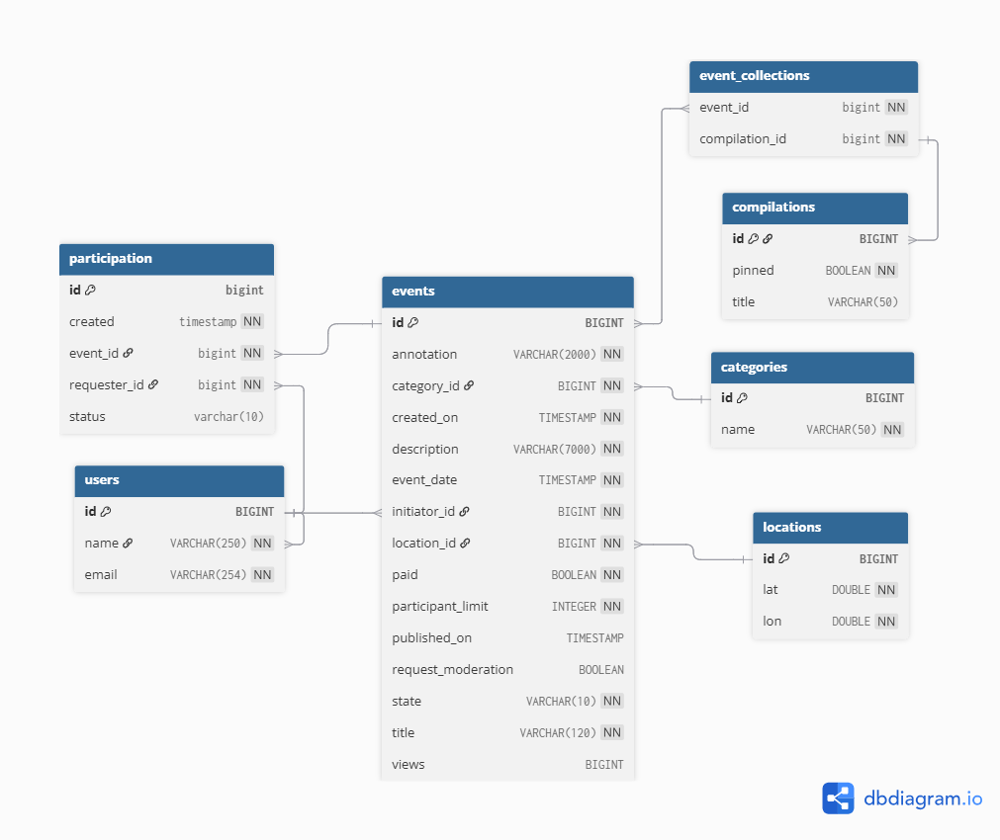

# java-explore-with-me - Исследуй со мной 

> Простое веб-приложенеи-позволяющее предлагать события и собирать компанию для совместного время припровождения.

## О проекте

- **Помогает объеденять людей, вместе проводить время** 
- **Ключевые фичи:**
  - Создание события
  - Размещение заявок на участие 
  - Возможность одобрять, отклонять заявки 
  - Просмотр событий с применением филтров поиска 
- **В разработке**
- **Документация API**
## ER - диаграмма 

## Функциональность - комментарии 
[pull request](https://github.com/AlekseySeledtcov/java-explore-with-me/pull/6)

## Технологии

- **Язык**: Java 19
- **Сборка**: Maven 3.9.11
- **Веб‑фреймворк**: Spring Boot 3.3.2
- **ORM**: Hibernate 6.5.2 (JPA 3.1)
- **БД**: PostgreSQL 42.7.3 (драйвер)
- **Маппинг объектов**: MapStruct 1.6.3
- **Логирование**: SLF4J 2.0.13
- **Валидация**: Hibernate Validator 8.0.1
- **HTTP‑клиент**: Spring RestTemplate